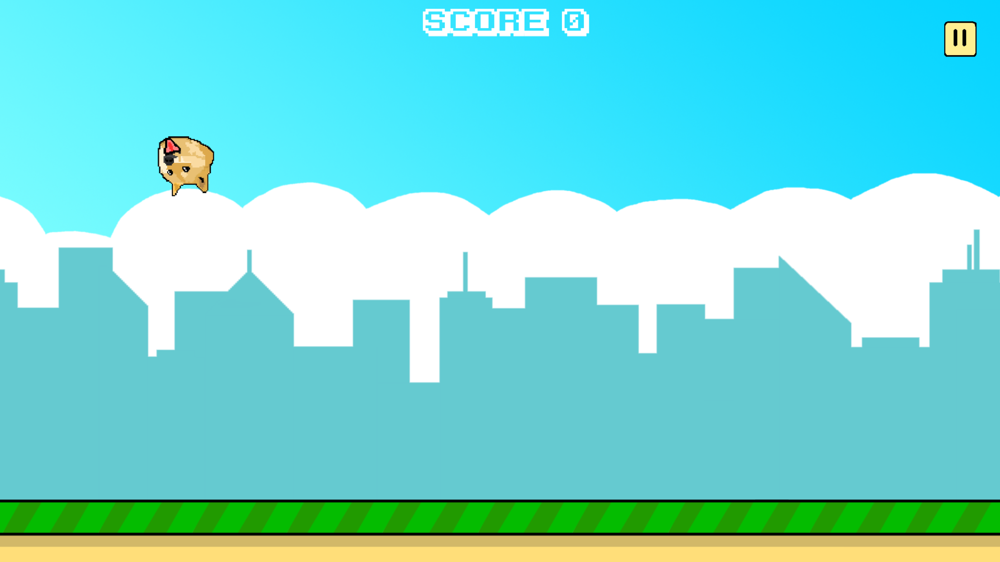
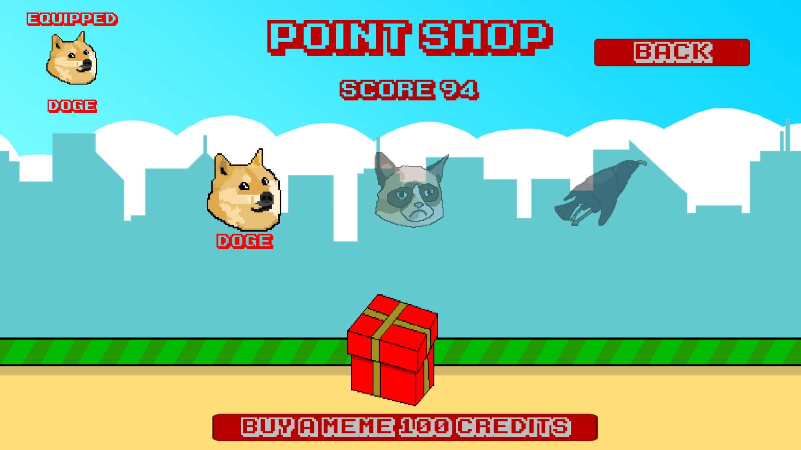

## Finding The Way

**Project description:** Finding The Way was my first project for mobile devices. It is a game inspired by the popular hit, Flappy Bird, in which the player has to navigate through obstacles by flapping.

**Tasks:** This began as a practice project, but soon I decided to format it for mobile and publish it to learn more about the mobile publishing process. I was responsible for creating the art, sound effects, and creating the game architecture. I also designed the UI and created a loot box interface for the user to unlock more character skins.
### Screenshots

