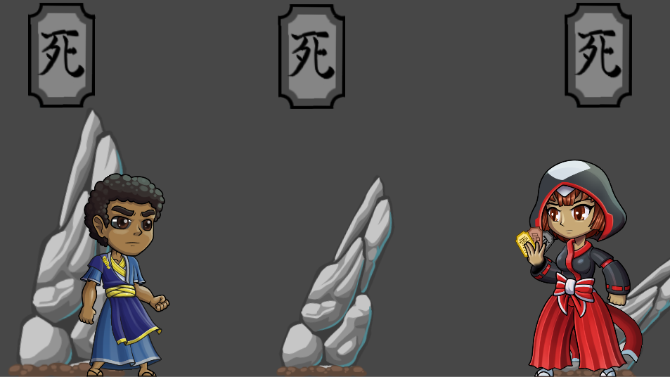
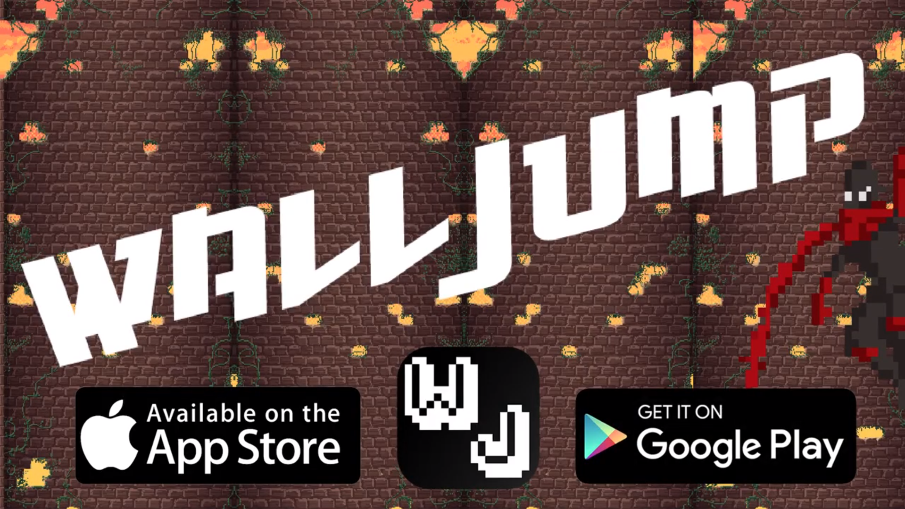

## Game Development Projects

A collection of games I've developed, both as freelance work and independent projects.

---

### Freelance Projects

[**Pins and Needles**](/PinsAndNeedles)

A 2D platformer featuring unique mechanics and engaging gameplay.

---

[**Minesweeper for Nintendo Switch**](/Minesweeper)

Classic Minesweeper reimagined for the Nintendo Switch platform.

---

[**Project Soul**](/UntitledRogueLike)

An exciting 2D roguelike adventure with procedurally generated levels.

---

[**Nintendo Labo Project**](/LaboProj)

An innovative tower defense game with AI integration for Nintendo Labo.

---

### Independent Projects

[**Finding The Way**](/FindingTheWay)

A Flappy Bird-inspired mobile game with unique twists.

---

[**Target Blitz**](/TargetBlitz)

A fast-paced 2D action mobile game focused on precision and speed.

---

[**Just WallJump**](/JustWallJump)

A mobile platformer featuring wall-jumping mechanics and competitive leaderboards.

---

[**Insert Title Text Here**](/InsertTitleTextHere)

A creative game jam entry developed for Ludum Dare.

---
