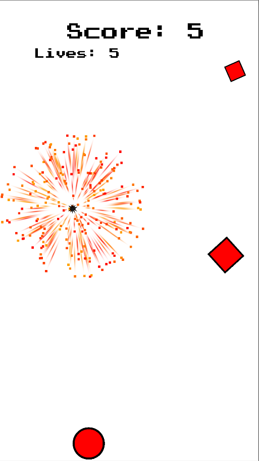
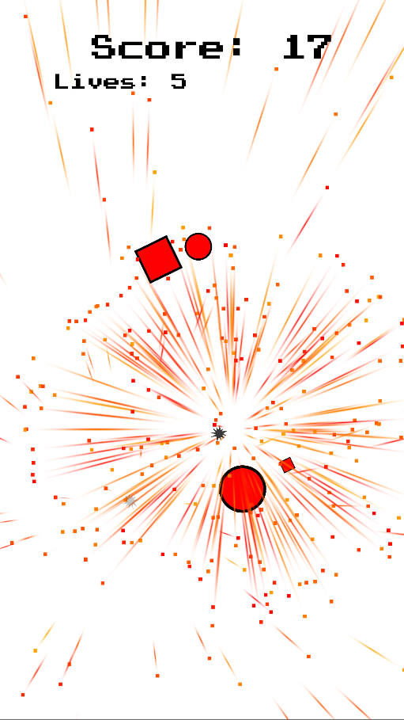
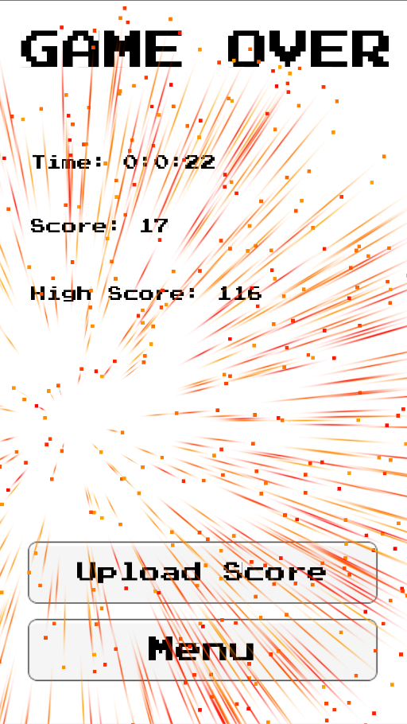

## Insert Title Text Here

**Project description:** Target Blitz is a 2D action game for mobile platforms designed to enhance hand-eye coordination and improve accuracy for mobile gaming

**Tasks:** Target Blitz was one of my first projects. I was the sole programmer and designer creating the game architecture, particle effects, art, sound, and music.
### Screenshots

