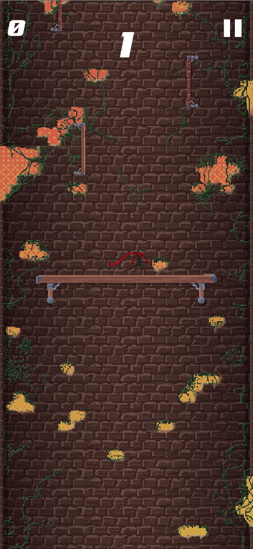

## Just WallJump

**Project description:** Just Walljump is a mobile 2D action platformer following the walljumper ninja traversing obstacles by jumping from wall to wall up a vertical tower.

**Tasks:** Just Walljump was one of my first independent projects outside of freelance. I initiated the project to learn more about networking by fabricating an online leaderboard, but it quickly escelated and I saw more potential. I was the sole programmer for the project constructing the game architecture, UI, physics, and  I hired pixel artists for the environment and character and a composer for the game's soundtrack. 

### Screenshots

