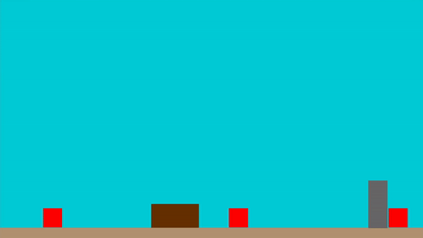

## Minesweeper for Nintendo Switch

**Project description:** This was a short commisison to design enemy AI for a video game utilizing Nintendo Labo technologies. The game is in the style of a tower defense in which enemies attack fortresses one by one and the player must defend them by constructing physical defenses which are converted virtually.

**Tasks:** I created the default enemy AI for the project consisting of randomized movements and allowing enemies to duck for cover within the environment. The brown box is a randomly generated obstacle the enemies can use for cover and the grey box is the structure enemies will line up behind to slowly demolish it.
### Screenshots
---

