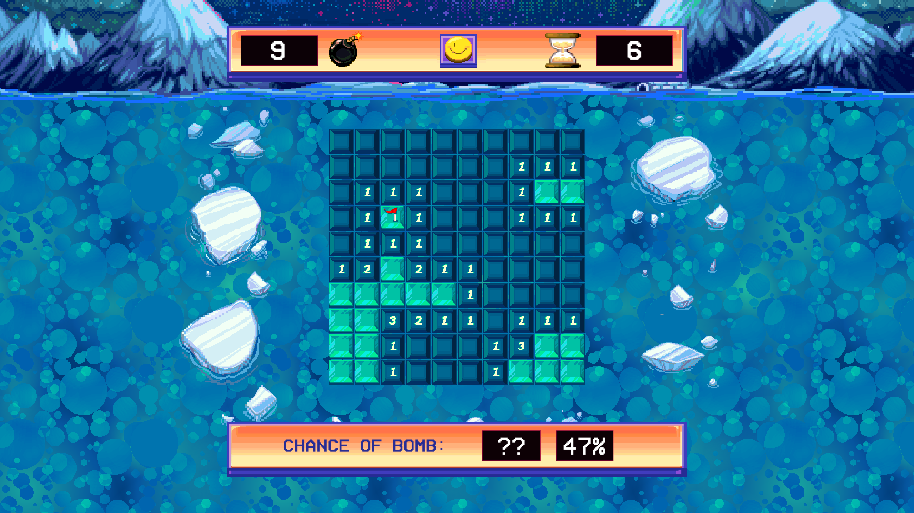
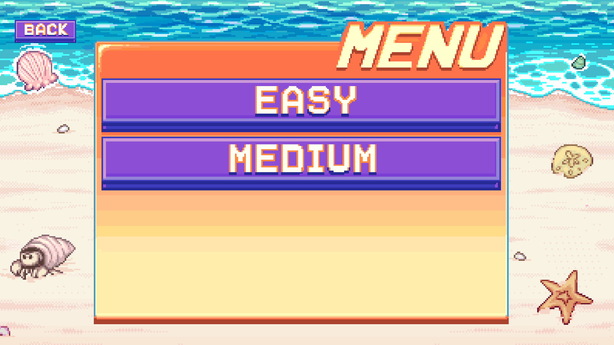
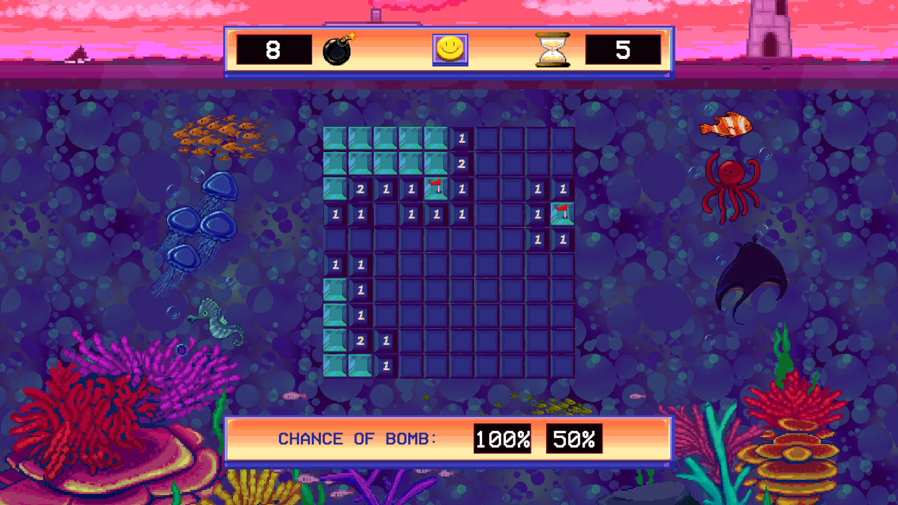
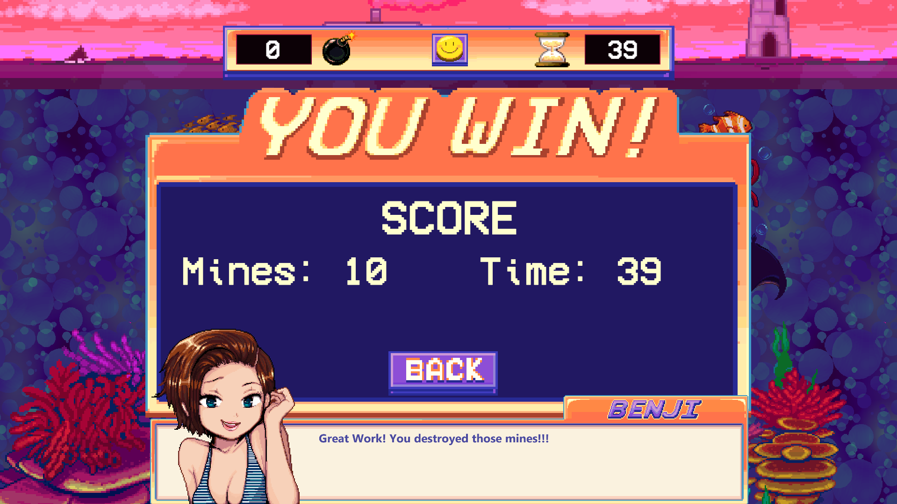

## Minesweeper for Nintendo Switch

**Project description:** Minesweeper for the Nintendo Switch is a 2D puzzle game in which the player combs a field of tiles for randomly placed bombs. Each clicked tile will tell the player how many mines are adjecent to the tile, so he or she can place markers on each and ever mine. Find all the mines and you win!

**Tasks:** I was the sole programmer for Minesweeper for Nintendo Switch working concurrently with artists and sfx designers to assemble the project. I created the game architecture as well as designing intricate UI interfaces compatible with PC and Console controls. 

### Screenshots

