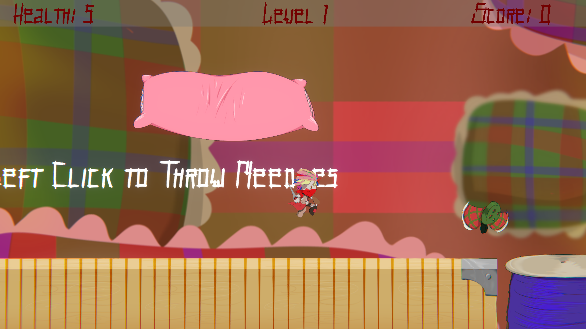
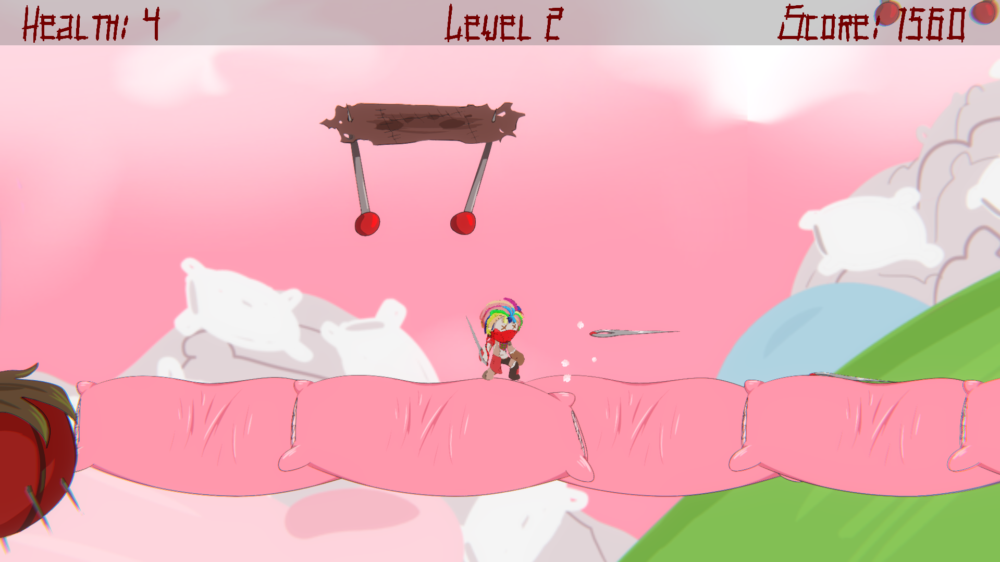
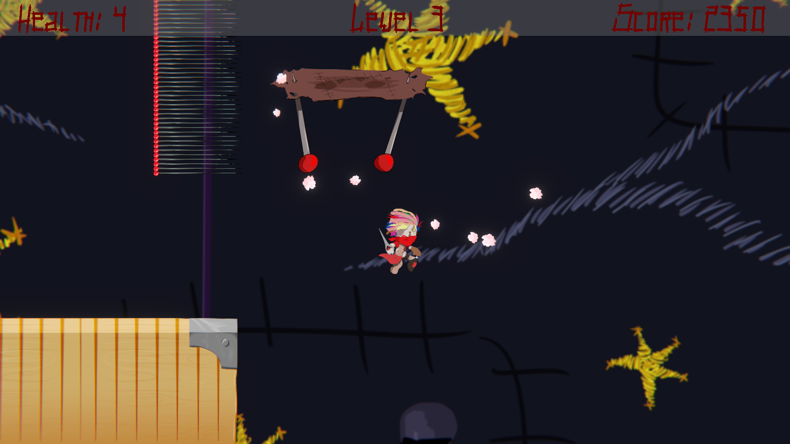
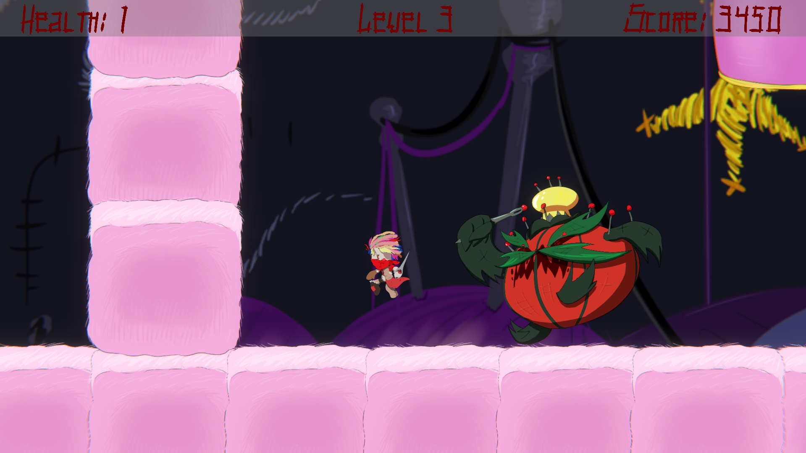

[← Back to Game Projects](/GameProjects)

## Pins And Needles

### About This Project

Pins and Needles is a 2D platformer project with advanced movement elements. Play as Stitch and travel through multiple sewed-on stages to defeat the tyrannical Pin King.

### My Role

Pins and Needles was one of my first freelancing contracts. I was the sole programmer for the project, responsible for:

- UI Development
- Game Architecture
- Physics Systems
- Particle Effects
- User Feedback Mechanics
- Level Design

The project was a massive undertaking and took approximately three months to complete.

### Screenshots

