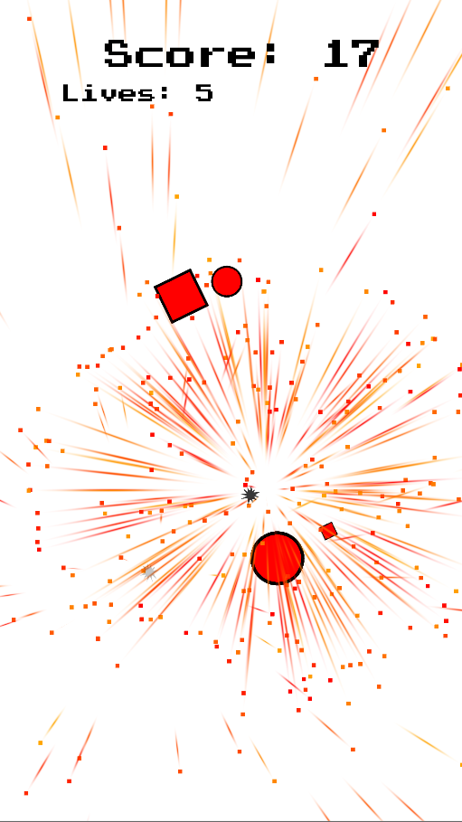
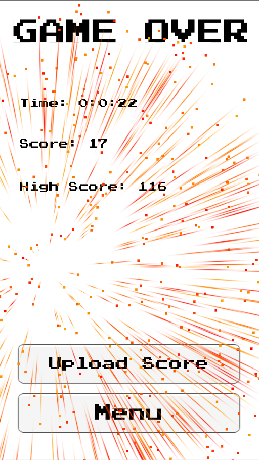

[← Back to Game Projects](/GameProjects)

## Target Blitz

### About This Project

Target Blitz is a 2D action game for mobile platforms designed to enhance hand-eye coordination and improve accuracy for mobile gaming.

### My Role

Target Blitz was one of my first projects. I was the sole programmer and designer, responsible for:

- Game Architecture
- Particle Effects
- Art Design
- Sound Effects
- Music Composition

### Screenshots

