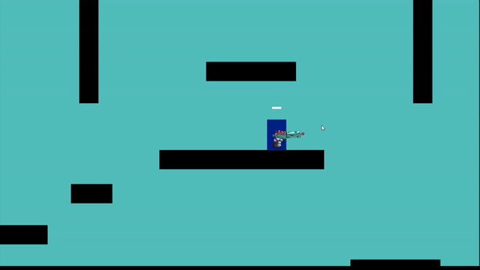

## Project Soul

**Project description:** This project is still in development. Its a 2D roguelike game set in Japan during the Edo period. It follows a pair of sibblings battling through enemies utilizing elemental abilities and weapons.

**Tasks:** My task for this project was to construct the core game architecture, physics, and weapon mechanics. Much of the mobility was inspired by movement from the Super Smash Brothers Series and each weapon was created with a specific element in mind. Examples: A hammer that shudders the earth creating rows of spikes, shurikens exploding with rings of fire, or a whip generating gusts of wind to give the player a dash of mobility.

### Screenshots

