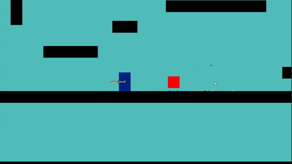

[← Back to Game Projects](/GameProjects)

## Project Soul

### About This Project

This project is still in development. It's a 2D roguelike game set in Japan during the Edo period. It follows a pair of siblings battling through enemies utilizing elemental abilities and weapons.

### My Role

My task for this project was to construct the core game architecture, physics, and weapon mechanics. Key features include:

- Movement system inspired by Super Smash Brothers Series
- Elemental weapon mechanics:
  - Hammer that shudders the earth creating rows of spikes
  - Shurikens exploding with rings of fire
  - Whip generating gusts of wind for mobility boosts

### Screenshots

