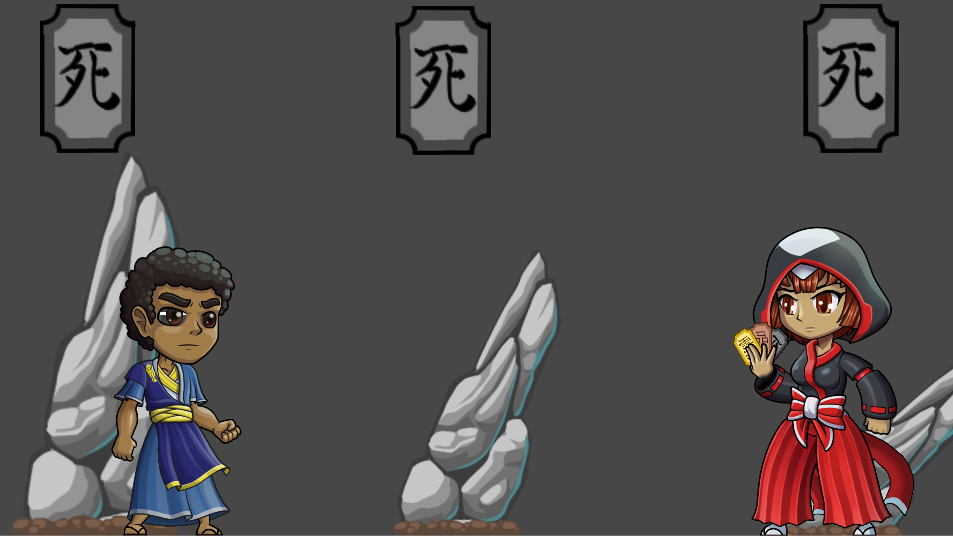

## Welcome to My Portfolio!

Hi there! I'm a software engineer passionate about game development and data science.

Explore my work through the sections below:

---

<nav>
<a href="/GameProjects">Game Development Projects</a>
<a href="/SchoolProjects">School Projects</a>
</nav>

---

### Featured Projects

#### Game Development Highlights

Check out some of my favorite game projects:

[**Pins and Needles**](/PinsAndNeedles) - A 2D platformer with unique mechanics

---

[**Minesweeper for Nintendo Switch**](/Minesweeper) - Classic puzzle game reimagined

---

[**Project Soul**](/UntitledRogueLike) - Roguelike adventure with procedural generation

---

[View All Game Projects →](/GameProjects)

---

### About Me

I'm a software engineer with experience in:
- Game Development (Unity, C#)
- Data Science & Machine Learning
- Full-Stack Development

[View My School Projects →](/SchoolProjects)

